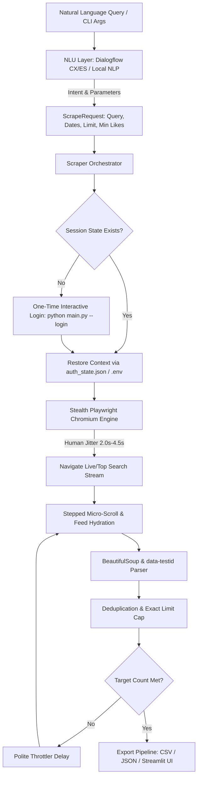

<div align="center">

# 🐦 X-Ray: Intelligent Twitter/X Scraper & NLU Pipeline

### *High-Speed, Polite & Stealth Live Tweet Extraction Powered by Playwright and Natural Language Understanding*

[](https://x-ray-tweet-scraper.streamlit.app/)
[](https://www.python.org/)
[](https://playwright.dev/)
[](https://streamlit.io/)
[](LICENSE)
[](https://github.com/MuhammadAsad29/x-ray-tweet-scraper)

<br>

**[🌐 Try the Live Interactive Web Dashboard](https://x-ray-tweet-scraper.streamlit.app/)**

<br>

---

</div>

## 📌 Overview

**X-Ray** is a production-grade, stealth-oriented scraper engineered to harvest live, historical, and viral tweets matching any hashtag, keyword, engagement threshold, or date range—**completely free without requiring Twitter/X API subscriptions**.

By pairing **Dialogflow NLU** (with a local regex/NLP fallback) with **Playwright Chromium Automation**, users can request scraping jobs using natural, conversational prompts (e.g., *"Scrape top 25 tweets for #PSL2026 with min 50 likes"*). The system features human-like delay jitter, stepped micro-scrolling, session persistence, and instant dataset export to CSV/JSON.

---

## ✨ Key Highlights

- 🧠 **Conversational NLU Intent Engine**: Translate human queries into Twitter advanced search operators (`min_faves`, `since`, `until`, `lang`, `top/live`). Supports Google Cloud Dialogflow CX/ES with automatic fallback to local regex NLP.
- 🥷 **Anti-Detection & Stealth Controls**: Overrides `navigator.webdriver`, spoofs `window.chrome`, masks automation blink features, and emulates realistic desktop screen viewports.
- 🛡️ **Polite Throttling & Rate-Limit Defense**: Implements Gaussian delay jitter ($2.0s - 4.5s$), stepped mouse wheel scrolling, and dynamic exponential backoff upon network/rate-limit triggers.
- 🔑 **Zero-Login Headless Execution**: Injects session cookies (`auth_token` and `ct0`) directly from `.env` or saved `auth_state.json` to bypass recurring CAPTCHAs and 2FA.
- 📊 **Rich Streamlit Analytics Cockpit**: Dark glassmorphic dashboard featuring live tweet feed cards, interactive Plotly visualization charts, and 1-click dataset export.
- 💾 **Clean Structured Export**: Extracts `tweet_id`, `url`, `username`, `display_name`, `text`, `timestamp`, `replies`, `retweets`, `likes`, `views`, and attached media.

---

## 🏗️ System Architecture



---

## 📁 Repository Structure

```
x-ray-tweet-scraper/
├── config/
│   ├── settings.py              # Pydantic environment configuration & defaults
│   └── dialogflow_config.json    # Intent & entity schema definitions for Dialogflow
├── src/
│   ├── nlu/
│   │   ├── models.py            # ScrapeRequest schema & query generator
│   │   ├── dialogflow_client.py # Dialogflow CX & ES client with automatic fallback
│   │   └── local_nlu_fallback.py# Rule-based NLP parser for dates & hashtags
│   ├── core/
│   │   ├── stealth.py           # Anti-detection flags & navigator overrides
│   │   ├── polite_throttler.py  # Delay jitter (2.0-4.5s), backoff, natural scrolling
│   │   ├── session_manager.py   # Auth state manager & interactive login workflow
│   │   ├── parser.py            # BeautifulSoup + data-testid tweet DOM extractor
│   │   └── scraper_engine.py    # Playwright async timeline orchestration loop
│   └── storage/
│       └── exporter.py          # CSV/JSON/JSONL export pipeline & summary stats
├── tests/
│   └── test_scraper.py          # Unit test suite
├── app.py                       # Streamlit interactive web dashboard
├── main.py                      # CLI & prompt orchestration runner
├── requirements.txt             # Project dependencies
├── .env.example                 # Environment template
├── .gitignore                   # Secrets and cache guard
├── LICENSE                      # MIT Open Source License
└── README.md                    # Project documentation
```

---

## 🚀 Quick Setup & Installation

### 1. Clone the Repository
```bash
git clone https://github.com/MuhammadAsad29/x-ray-tweet-scraper.git
cd x-ray-tweet-scraper
```

### 2. Create Virtual Environment & Install Dependencies
```bash
python -m venv venv

# Windows:
.\venv\Scripts\activate

# Linux/macOS:
source venv/bin/activate

pip install -r requirements.txt
playwright install chromium
```

### 3. Configure Authentication (`.env`)
Copy `.env.example` to `.env`:
```bash
cp .env.example .env
```

Set your session cookies in `.env` (extracted via browser `F12` $\rightarrow$ `Application` $\rightarrow$ `Cookies` $\rightarrow$ `https://x.com`):
```ini
TWITTER_AUTH_TOKEN=your_auth_token_here
TWITTER_CT0=your_ct0_here
```
*(Alternatively, run `python main.py --login` to perform a one-time headful browser login and auto-generate `config/auth_state.json`).*

---

## 💻 Usage

### 🌟 1. Launch Interactive Streamlit Dashboard
```bash
python -m streamlit run app.py
```
Open **`http://localhost:8501`** in your browser to access the live dashboard with interactive cards, Plotly charts, preset prompt chips, and 1-click dataset export.

---

### 🧠 2. Natural Language CLI Mode
```bash
# Scrape high-reach viral tweets
python main.py --prompt "Scrape top 25 tweets for #PSL2026 with min 50 likes"

# Scrape live recent tweets
python main.py --prompt "Collect 30 live tweets about #ArtificialIntelligence"

# Date range search
python main.py --prompt "Scrape 50 tweets for #Bitcoin from 2025-05-01 to 2025-05-15"
```

---

### 🎛️ 3. Direct Flag CLI Mode
```bash
python main.py --query "#metaverse" --top --min-likes 70 --limit 10 --format csv
```

---

### 🧪 4. Run Automated Unit Tests
```bash
python -m unittest discover tests
```

---

## 📊 Output Schema

Datasets exported to the `output/` folder contain the following schema:

| Column | Type | Description |
| :--- | :--- | :--- |
| `tweet_id` | `str` | Unique Twitter status identifier (e.g. `1880000000000000000`) |
| `url` | `str` | Direct permalink to the tweet on X |
| `username` | `str` | Author's handle (e.g. `@elonmusk`) |
| `display_name` | `str` | Author's public display name |
| `text` | `str` | Clean tweet text with emojis and links |
| `timestamp` | `str` | UTC timestamp in ISO 8601 format (`YYYY-MM-DDTHH:MM:SS.000Z`) |
| `replies` | `int` | Count of replies |
| `retweets` | `int` | Count of retweets |
| `likes` | `int` | Count of likes / favorites |
| `views` | `int` | View / impression count |
| `is_retweet` | `bool` | Boolean flag indicating retweet status |
| `media_urls` | `list` | Image / thumbnail media links attached |

---

## ⚖️ Ethical Scraping & Fair Use Policy

This tool was designed for **academic research, sentiment analysis, trend tracking, and educational purposes**.
- **Polite Execution**: The scraper implements conservative delays ($2.0s - 4.5s$) to avoid overwhelming web services.
- **Compliance**: Please respect Twitter/X's Terms of Service and data privacy regulations. Avoid scraping private personal data.

---

## 👨‍💻 Author

**Muhammad Asad**
- **GitHub**: [@MuhammadAsad29](https://github.com/MuhammadAsad29)
- **Project**: [x-ray-tweet-scraper](https://github.com/MuhammadAsad29/x-ray-tweet-scraper)
- **Live Demo**: [x-ray-tweet-scraper.streamlit.app](https://x-ray-tweet-scraper.streamlit.app/)

---

## 📜 License

Distributed under the **MIT License**. See [`LICENSE`](LICENSE) for more information.
